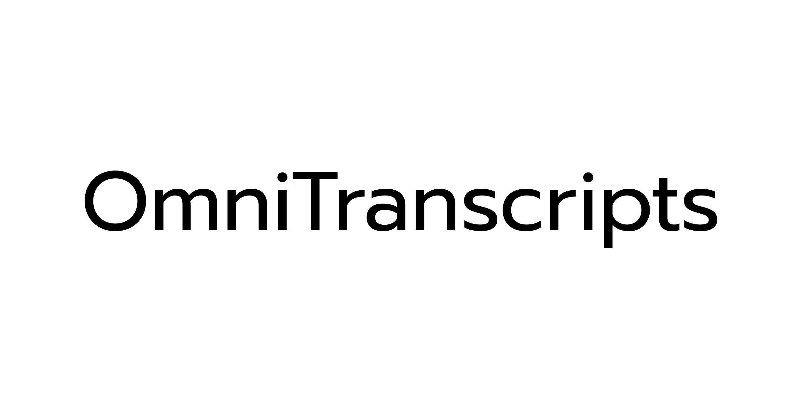

# OmniTranscripts

[](https://golang.org/doc/go1.23)
[](LICENSE)
[](https://github.com/wilmoore/omnitranscripts/stargazers)
[](https://github.com/wilmoore/omnitranscripts/issues)
[](Dockerfile)
[](https://encore.dev)

> Universal media transcription engine for audio and video from any URL. Powered by Go, yt-dlp, FFmpeg, and whisper.cpp.



## Features

- **Universal Media Transcription**: Transcribe audio and video from 1000+ platforms via yt-dlp
- **Audio-First**: Audio-only workflows are first-class citizens (podcasts, voice memos, audio files)
- **Dual Consumption**: Use as a Go library or HTTP API from the same codebase
- **Fast Processing**: Optimized pipeline with native Go libraries and FFmpeg
- **Async & Sync**: Short media (<2min) returns transcripts immediately, longer media uses job queue
- **Multiple Output Formats**: SRT, VTT, JSON, TSV, and plain text
- **Structured Errors**: Stage-specific error reporting (download, normalize, transcribe)
- **Production Ready**: Database support, metrics, monitoring, and webhooks
- **Docker & Cloud Ready**: Easy deployment with comprehensive guides

## Documentation

<div align="center">

<table>
  <tr>
    <td>
      <h3>Quick Start</h3>
      <p>Get up and running in minutes.</p>
      <a href="#quick-start"><strong>Read guide</strong></a>
    </td>
    <td>
      <h3>API Docs</h3>
      <p>Complete reference with request & response examples.</p>
      <a href="docs/api.md"><strong>Explore</strong></a>
    </td>
    <td>
      <h3>Architecture</h3>
      <p>Deep dive into the system design and patterns.</p>
      <a href="docs/architecture.md"><strong>Understand</strong></a>
    </td>
    <td>
      <h3>Deployment</h3>
      <p>Production-ready deployment playbooks.</p>
      <a href="docs/deployment.md"><strong>Deploy</strong></a>
    </td>
  </tr>
  <tr>
    <td>
      <h3>Development</h3>
      <p>Local setup, workflows, and contributor tooling.</p>
      <a href="docs/development.md"><strong>Build</strong></a>
    </td>
    <td>
      <h3>Troubleshooting</h3>
      <p>Quick fixes for common pitfalls and errors.</p>
      <a href="docs/troubleshooting.md"><strong>Fix</strong></a>
    </td>
    <td>
      <h3>Contributing</h3>
      <p>Guidelines for issues, pull requests, and reviews.</p>
      <a href="docs/contributing.md"><strong>Join</strong></a>
    </td>
    <td>
      <h3>Changelog</h3>
      <p>Track version history and notable updates.</p>
      <a href="docs/changelog.md"><strong>Review</strong></a>
    </td>
  </tr>
</table>

</div>

## Quick Start

### Docker (Recommended)
```bash
# Run with Docker
docker run -d \
  --name omnitranscripts \
  -p 3000:3000 \
  -e API_KEY=your-api-key-here \
  wilmoore/omnitranscripts:latest
```

### Local Development
```bash
# 1. Install dependencies
# macOS
brew install go ffmpeg
pip install openai-whisper

# Ubuntu/Debian
sudo apt install golang-go ffmpeg python3-pip
pip install openai-whisper

# 2. Clone and run
git clone https://github.com/wilmoore/omnitranscripts.git
cd omnitranscripts
cp .env.example .env  # Edit with your settings
make dev
```

### Encore.dev (Production)
```bash
# Deploy to production in one command
curl -L https://encore.dev/install.sh | bash
encore deploy --env production
```

## Usage

### As a Go Library

```go
import "omnitranscripts/engine"

// Transcribe any URL (YouTube, Vimeo, SoundCloud, direct audio URLs, etc.)
result, err := engine.Transcribe(
    "https://example.com/audio.mp3",
    "job-123",
    engine.DefaultOptions(),
)
if err != nil {
    var tErr *engine.TranscriptionError
    if errors.As(err, &tErr) {
        fmt.Printf("Failed at stage %s: %s\n", tErr.Stage, tErr.Message)
    }
    return err
}

fmt.Println(result.Transcript)
for _, seg := range result.Segments {
    fmt.Printf("[%0.1fs - %0.1fs] %s\n", seg.Start, seg.End, seg.Text)
}
```

### As an HTTP API

#### `POST /transcribe`

Transcribe media from any supported URL.

**Request:**
```json
{
  "url": "https://www.youtube.com/watch?v=dQw4w9WgXcQ"
}
```

**Response (Short Media):**
```json
{
  "transcript": "Never gonna give you up, never gonna let you down...",
  "segments": [
    {
      "start": 0.0,
      "end": 3.5,
      "text": "Never gonna give you up"
    }
  ]
}
```

**Response (Long Media):**
```json
{
  "job_id": "123e4567-e89b-12d3-a456-426614174000"
}
```

#### `GET /transcribe/{job_id}`

Get the status and result of a transcription job.

**Response:**
```json
{
  "id": "123e4567-e89b-12d3-a456-426614174000",
  "status": "complete",
  "transcript": "Never gonna give you up...",
  "segments": [...],
  "created_at": "2024-01-01T12:00:00Z",
  "completed_at": "2024-01-01T12:02:30Z"
}
```

Possible statuses: `pending`, `running`, `complete`, `error`

#### `GET /health`

Health check endpoint (no authentication required).

**Complete API documentation:** [docs/api.md](docs/api.md)

## Usage Examples

### cURL

```bash
# Transcribe a video
curl -X POST http://localhost:3000/transcribe \
  -H "Authorization: Bearer YOUR_API_KEY" \
  -H "Content-Type: application/json" \
  -d '{"url": "https://www.youtube.com/watch?v=dQw4w9WgXcQ"}'

# Transcribe a podcast
curl -X POST http://localhost:3000/transcribe \
  -H "Authorization: Bearer YOUR_API_KEY" \
  -H "Content-Type: application/json" \
  -d '{"url": "https://example.com/podcast-episode.mp3"}'

# Check job status
curl -X GET http://localhost:3000/transcribe/YOUR_JOB_ID \
  -H "Authorization: Bearer YOUR_API_KEY"
```

### JavaScript

```javascript
const response = await fetch('http://localhost:3000/transcribe', {
  method: 'POST',
  headers: {
    'Authorization': 'Bearer YOUR_API_KEY',
    'Content-Type': 'application/json'
  },
  body: JSON.stringify({
    url: 'https://www.youtube.com/watch?v=dQw4w9WgXcQ'
  })
});

const result = await response.json();
```

**More usage examples and SDKs:** [docs/api.md](docs/api.md)

## Development Setup

### Prerequisites
- **Go 1.23+** - [Install Go](https://golang.org/doc/install)
- **FFmpeg** - `brew install ffmpeg` (macOS) or `sudo apt install ffmpeg` (Linux)
- **OpenAI Whisper** - `pip install openai-whisper`

### Quick Setup
```bash
# Clone and setup
git clone https://github.com/wilmoore/omnitranscripts.git
cd omnitranscripts
cp .env.example .env  # Edit with your settings
make dev
```

**Detailed development guide:** [docs/development.md](docs/development.md)

## Make Commands

```bash
make help          # Show all available commands
make dev           # Development server with hot reload
make test          # Run all tests
make build         # Build for current platform
make check         # Run quality checks (fmt + lint + vet + test)
```

**Complete command reference:** [docs/development.md#using-the-makefile](docs/development.md#using-the-makefile)

## Production Deployment

### Docker (Recommended)
```bash
docker build -t omnitranscripts .
docker run -p 3000:3000 --env-file .env omnitranscripts
```

### Encore.dev (Zero-Config)
```bash
encore deploy --env production
```

### Cloud Platforms
- **AWS ECS/Fargate** - Container-based deployment
- **Google Cloud Run** - Serverless containers
- **Azure Container Instances** - Managed containers
- **Kubernetes** - Full orchestration

**Complete deployment guides:** [docs/deployment.md](docs/deployment.md)

## Architecture

**Three-Stage Pipeline:**
1. **Download** - Extract audio from any URL (yt-dlp, supports 1000+ platforms)
2. **Normalize** - Convert to 16kHz mono WAV (FFmpeg)
3. **Transcribe** - Generate timestamped transcripts (whisper.cpp)

**Smart Processing:**
- Media <=2min: Synchronous (immediate results)
- Media >2min: Asynchronous (job queue with status tracking)

**Dual Consumption Model:**
- `engine/` package: Direct Go library usage
- HTTP API: Thin adapter over the engine

**Detailed architecture:** [docs/architecture.md](docs/architecture.md)

## API Documentation

Full OpenAPI/Swagger documentation available at [`docs/swagger.yaml`](docs/swagger.yaml).

## Troubleshooting

**Common issues and solutions:** [docs/troubleshooting.md](docs/troubleshooting.md)

## Contributing

We welcome contributions! Please see our [contributing guide](docs/contributing.md) for details on:
- Setting up your development environment
- Coding standards and best practices
- Submitting issues and pull requests
- Community guidelines

## License

This project is licensed under the MIT License - see the [LICENSE](LICENSE) file for details.

---

<div align="center">

**Star this repo if it's helpful!**

[Report Bug](https://github.com/wilmoore/omnitranscripts/issues) | [Request Feature](https://github.com/wilmoore/omnitranscripts/issues) | [Discussions](https://github.com/wilmoore/omnitranscripts/discussions)

**Built with care by [wilmoore](https://github.com/wilmoore)**

</div>
